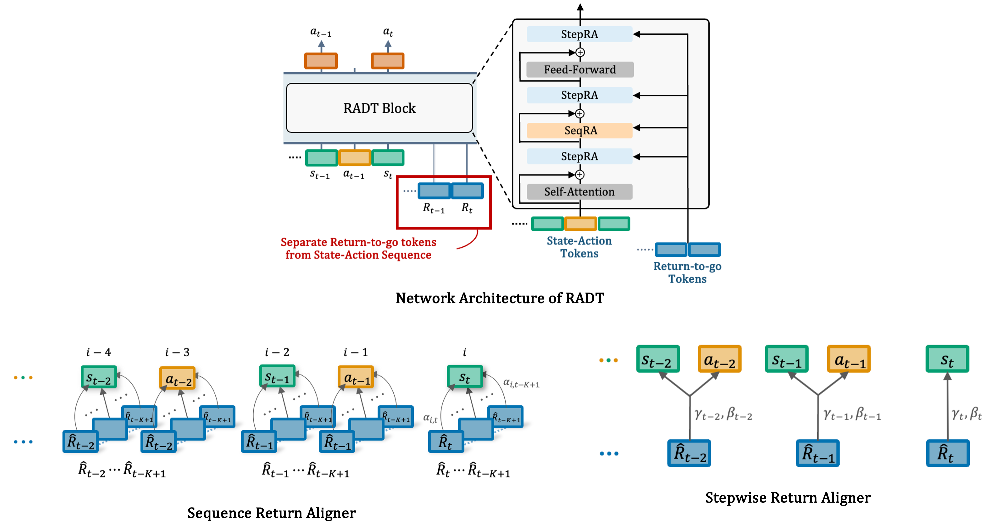

<div align="center">
<h1> Return-Aligned Decision Transformer </h1>
</div>

<h3 align="center">
Transactions on Machine Learning Research, 2025
</h3>




Paper: https://arxiv.org/abs/2402.03923

Return-Aligned Decision Transformer (RADT) is an offline RL model architecture that uses return-focused attention to align an agent’s performance with a user-specified target return.

## Prerequisites

| Software      |
|-------------- |
| Python >=3.10 |
| Docker        |
| CUDA          |

We provide code in two sub-directories: `atari` containing code for Atari experiments and `gym` containing code for OpenAI Gym experiments.

## Gym
First, change to the `gym` directory:

```shell
cd gym
```

Before you run the container, create the host directories that will be bind-mounted into the image.
```shell
mkdir logs
```

### Setup
1. Build a Docker image
```shell
./scripts/docker/build.sh
```

2. Attach a container to your shell
```shell
./scripts/docker/run.sh
```

### Downloading datasets

Datasets are stored in the `data-gym` directory.
Install the [D4RL repo](https://github.com/rail-berkeley/d4rl), following the instructions there.
Then, run the following script in order to download the datasets and save them in our format:

```shell
python3 data-gym/download_d4rl_datasets.py
```

### Usage
Experiments can be reproduced with the following:

```shell
# RADT
./scripts/train.sh exp_radt +experiment=hopper-medium

# dt
./scripts/train.sh exp_dt +experiment=hopper-medium model_type=dt
```

## Atari
We build our Atari implementation on top of [minGPT](https://github.com/karpathy/minGPT) and benchmark our results on the [DQN-replay](https://github.com/google-research/batch_rl?tab=readme-ov-file#dqn-replay-dataset-logged-dqn-data) dataset.

First, change to the `atari` directory:

```shell
cd atari
```

Before you run the container, create the host directories that will be bind-mounted into the image.
```shell
mkdir -p logs dqn_replay
```

### ROM
Download the Atari ROMs by following the instructions in [atari-py](https://github.com/openai/atari-py?tab=readme-ov-file#roms).
After unzipping the archive, create `roms` directory and place `HC ROMS` and `ROMS` inside it.

### Setup
1. Build a Docker image
```shell
./scripts/docker/build.sh
```

2. Attach a container to your shell
```shell
./scripts/docker/run.sh
```

### Downloading datasets
Download the Atari dataset by following the instructions in [batch_rl](https://github.com/google-research/batch_rl).

### Usage
Experiments can be reproduced with the following:

```shell
# RADT
./scripts/train.sh exp_radt +experiment=Breakout

# DT
./scripts/train.sh exp_dt +experiment=Breakout model_type=dt
```

## Acknowledgements
Our Return-Aligned Decision Transformer code is based on [decision-transformer](https://github.com/kzl/decision-transformer).

## Citation
```bibtex
@article{tanaka2025radt,
  author={Tanaka, Tsunehiko and Abe, Kenshi and Ariu, Kaito and Morimura, Tetsuro and Simo-Serra, Edgar},
  journal={Transactions on Machine Learning Research}, 
  title={Return-Aligned Decision Transformer}, 
  year={2025},
}
```

## License

This project is licensed under the [MIT License](LICENSE).
